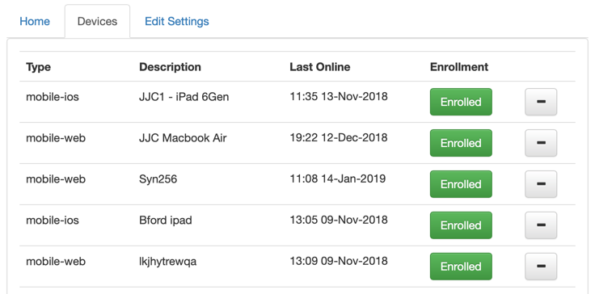

Admin Tasks
-----------

This section describes how to perform administration tasks for the Device plugin.

Enrolling Devices
`````````````````

The document type names displayed to the user can be update via the admin UI.
To update the names, follow this procedure:

----

#.  Open the Peek Admin UI and navigate to the Device plugin.

#.  Click on the **Device** tab

#.  Toggle the **Enrollment** button.

#.  Click save.



----

The user will see their device toggle from the "Waiting for enrollment" to the Peek
home screen.